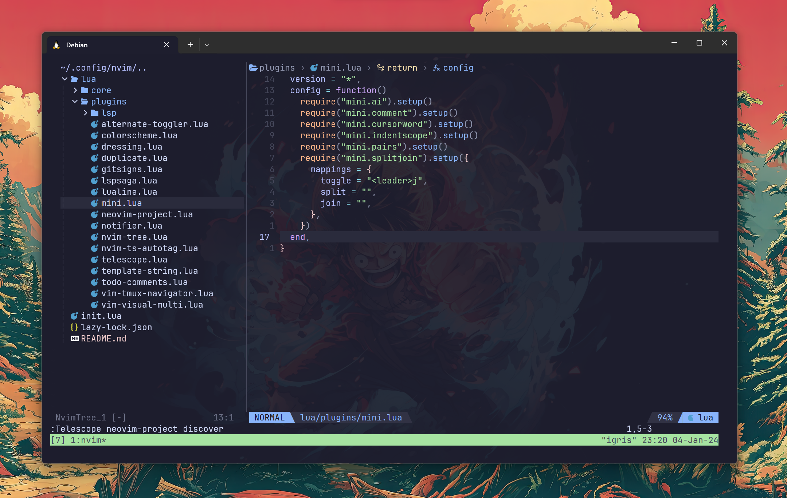

## Preview



## Config Structure

```sh
├── init.lua ( main init.lua )
│
├── lua
│   │
│   ├── core
│   │   ├── autocmd.lua     # Autocommands
│   │   ├── icons.lua       # Icons used in completion menus and other UIs
│   │   ├── init.lua        # Starting point for core module
│   │   ├── mappings.lua    # Custom keymaps
│   │   ├── options.lua     # Custom neovim options
│   │   └── utils.lua       # Module with reusable functions and tables
│   │
│   ├── plugins
│   │    │
│   │    │── lsp
│   │    │   ├── conform.lua
│   │    │   ├── mason.lua
│   │    │   ├── nvim-cmp.lua
│   │    │   ├── nvim-lint.lua
│   │    │   ├── nvim-lspconfig.lua
│   │    │   ├── nvim-treesitter.lua
│   │    │   └── typescript-tools.lua
│   │    │
│   │    ├── alternate-toggler.lua
│   │    ├── colorscheme.lua
│   │    ├── dressing.lua
│   │    ├── duplicate.lua
│   │    ├── gitsigns.lua
│   │    ├── harpoon.lua
│   │    ├── lazygit.lua
│   │    ├── lspsaga.lua
│   │    ├── lualine.lua
│   │    ├── mini.lua
│   │    ├── notifier.lua
│   │    ├── nvim-tree.lua
│   │    ├── nvim-ts-autotag.lua
│   │    ├── telescope.lua
│   │    ├── template-string.lua
│   │    ├── todo-comments.lua
│   │    ├── vim-tmux-navigator.lua
│   │    └── vim-visual-multi.lua
```
